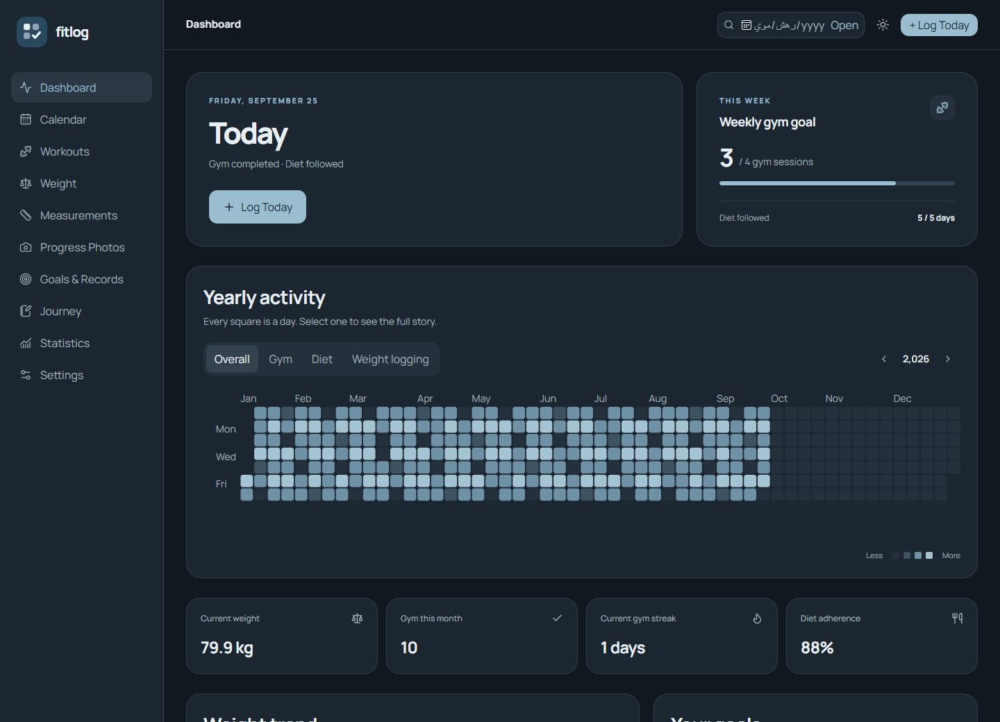
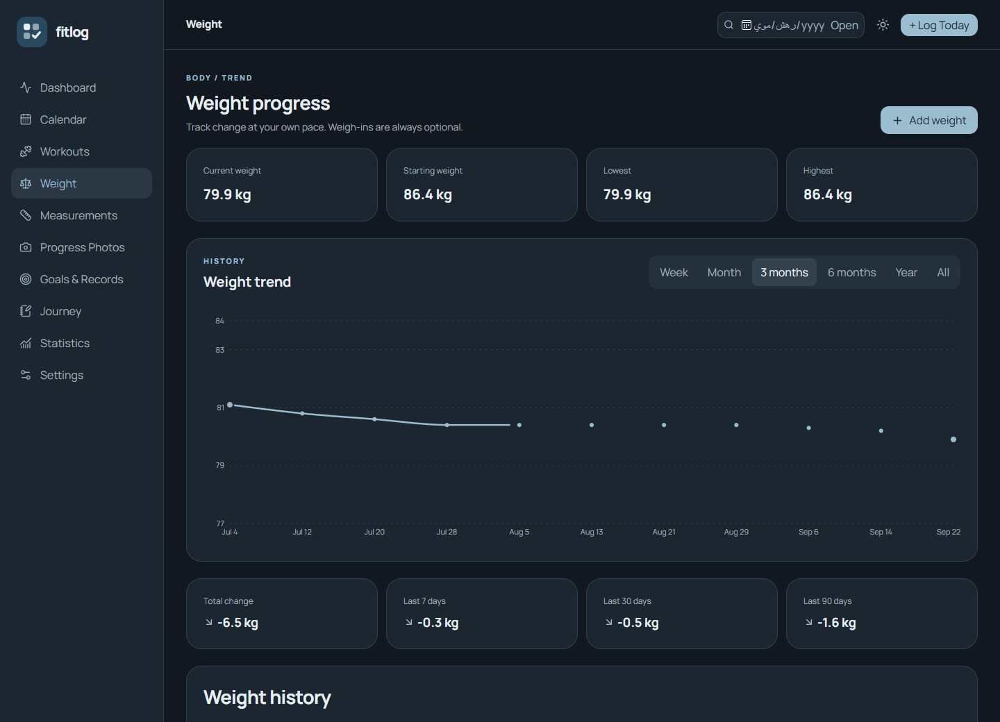
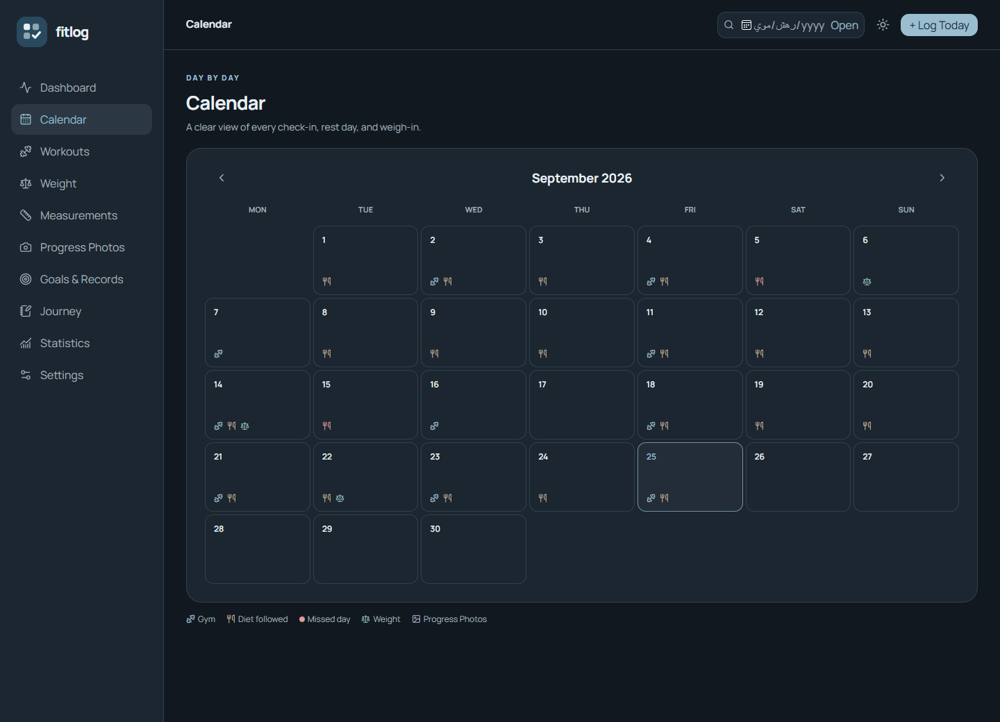
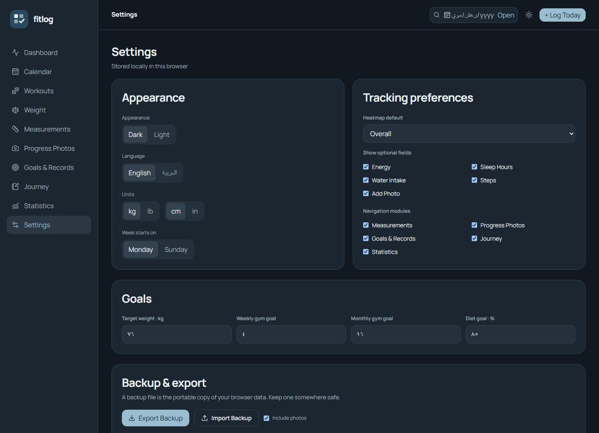

# FitLog

A private, local fitness journal for one person. It runs on `127.0.0.1`, stores structured records and progress photos in the browser's IndexedDB, and makes no cloud or external API requests. PHP and XAMPP are not required.

## Screenshots

Screenshots below use generated demo records and contain no personal logs or photos.

| Dashboard · dark | Weight progress |
| --- | --- |
|  |  |

| Calendar | Settings |
| --- | --- |
|  |  |

## Install and run (Windows)

1. Install Node.js 20.19+ once.
2. In this folder, run `npm ci` once while online.
3. Double-click `start.bat`, or run `npm run build` then `npm start`.
4. Open **http://127.0.0.1:4173/** in your browser. Keep the terminal open while using the app.

After dependencies are installed, FitLog builds and runs without an internet connection. Use the same browser profile and the exact address above each time. Browsers treat a different port or browser profile as a different local database. The development server (`npm run dev`) is for development only and uses port 5173, so its records are separate.

Close any running FitLog server before reinstalling dependencies on Windows; a running server can hold native build files open.

## Daily use

- Press **Log Today** to mark gym and diet status. Weight and the expanded details are optional.
- Click a heatmap square or calendar day to edit its log, notes, and optional measurements.
- Use **Workouts** for detailed sessions, exercises, sets, and records. A saved workout marks that day as gym completed.
- Add progress photos in **Progress Photos** and select two to compare them side by side or with the slider.
- Switch language, theme, units, week start, visible modules, and check-in fields in **Settings**.

## Local data and backups

Records and original image blobs are stored in IndexedDB under this browser profile's `http://127.0.0.1:4173` origin. They are not written to a cloud service. **Settings → Export Backup** downloads a versioned `.fitlog.zip` file. Leave **Include photos** checked for a complete backup. **Import Backup** validates the file and shows its record counts before you choose to replace local data. Settings also exports four CSV files: weight, attendance, measurements, and workouts.

Export a backup regularly. Clearing site data, changing browser profiles, or changing the localhost port can make the existing browser database unavailable. The app can request persistent browser storage, but backup files remain the portable copy.

## Development

`npm run dev` starts Vite on port 5173. `npm run build` checks TypeScript and creates the standalone production assets in `dist/`. `npm start` serves that build on port 4173. The production assets bundle the English and Arabic fonts and all UI dependencies locally. The storage adapter lives in `src/data/repository.ts`; calculations live in `src/lib/stats.ts`. See [ARCHITECTURE.md](ARCHITECTURE.md) for the schema and module map.
